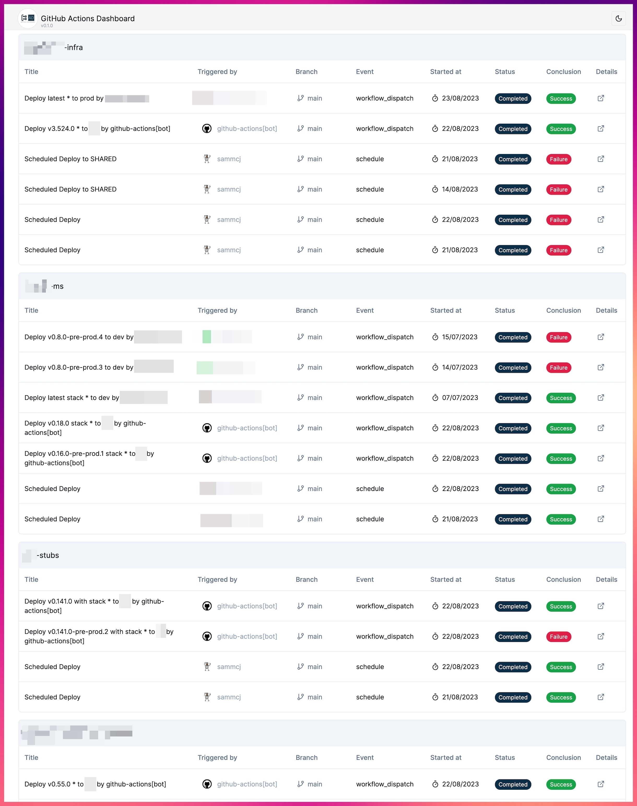

# Actions Dashboard

**NOTE: This project is not in active development**

Perhaps in the future I'll pick it up again when the need arises - or completely rewrite it.



## Setup

### Github App

Create a Github Application:

1. Scopes:
   - Repo
     - `Contents` (read-only)
     - `Actions` (read-only)
     - `Environments` (read-only)
2. Generate a private key
3. Install the app on your repositories, organisation, or account
4. Take note of the following:
   1. The App ID
   2. The App Installation ID
   3. The App Client ID
   4. The App Client Secret
   5. The App Private Key

### Configuration

A templated `.env` file is provided in the root of the project.
Copy this to `.env` and fill in the values.

| Variable                   | Default                   | Description                                                 | Required?                    |
| -------------------------- | ------------------------- | ----------------------------------------------------------- | ---------------------------- |
| API_LIMIT_ENVIRONMENTS     | 3                         | The maximum number of environments to fetch for a repo      | False                        |
| API_LIMIT_REPOS            | 3                         | The maximum number of repos to fetch for an owner           | ? REPO_SOURCE = getFromOwner |
| API_LIMIT_WORKFLOW_RUNS    | 2                         | The maximum number of workflow runs to fetch for a workflow | False                        |
| API_LIMIT_WORKFLOWS        | 5                         | The maximum number of workflows to fetch for a repo         | False                        |
| DEFAULT_BRANCH             | main                      | The default branch to fetch workflow runs from              | False                        |
| GITHUB_APP_CLIENT_ID       |                           | Github App Client ID                                        | ?  Github App Auth           |
| GITHUB_APP_CLIENT_SECRET   |                           | Github App Client Secret                                    | ?  Github App Auth           |
| GITHUB_APP_ID              |                           | Github App ID                                               | ?  Github App Auth           |
| GITHUB_APP_INSTALLATION_ID |                           | Github App Installation ID                                  | ?  Github App Auth           |
| GITHUB_APP_PRIVATE_KEY     |                           | Github App Private Key                                      | ?  Github App Auth           |
| GITHUB_OWNER               |                           | Github Owner or Organisation to fetch all repos from        | ? REPO_SOURCE = getFromOwner |
| LOG_LEVEL                  |                           | Log level (trace,debug,info,warn,error)                     | False                        |
| NEXT_TELEMETRY_DISABLED    | 1                         | Disable NextJS Telemetry                                    | False                        |
| REPO_LIST                  |                           | CSV of Owner/Repo                                           | ? REPO_SOURCE = repoList     |
| REPO_SOURCE                |                           | getFromOwner                                                | True                         |
| NEXT_PUBLIC_API_BASE       | http://localhost:3000/api | Backend API Server                                          | True                         |
| ISSUES_URL                 | (this repo/issues)        |                                                             | False                        |
| AUTH_METHOD                |                           | (App or Token) _NOT YET IMPLEMENTED_                        | False                        |
| GITHUB_TOKEN               |                           | A Read Only Github Private Token  _NOT YET IMPLEMENTED_     | False                        |

#### API Limits

- Keeping the API Limits as low as possible while providing the information you require will result in faster load times and less Github API usage.
- You probably only ever need a very small (1-2) limit for the most recent workflow runs.
- If you set a limit that's not used it will be ignored.

#### Repo Source

- `getFromAppInstallation`: Fetches all repos from the Github App used to authenticate (this is probably the best option for most people).
- `getFromOwner`: Fetches all repos from the owner or organisation specified in `GITHUB_OWNER`.
- `repoList`: Fetches the repos specified in `REPO_LIST`.
- `getFromOwner`, `getFromAppInstallation` and `repoList` are currently mutually exclusive.

#### URLs

- `NEXT_PUBLIC_API_BASE` is the URL of the backend API server.
  - Leave this as-is unless you know what you're doing.
  - This may be used in the future to optionally split the frontend and backend into separate services.
- `ISSUES_URL`: URL to the issues page for this project.

## Building

### Container

```bash
docker build -t actions-dashboard .
```

#### Compose

```bash
docker-compose build
```

### Node

```bash
npm ci
npm run build
```

## Running

- Production: http://localhost:3000
- Dev: http://localhost:8081

### Container

```bash
docker run --env-file .env -p 3000:3000 actions-dashboard
```

#### Compose

```bash
docker-compose up -d
```

### Node

Production:

```bash
npm run start
```

Dev:

```bash
npm run dev
```

---

## Architecture

Buzzwords:

- NextJS
- React
- Typescript
- TailwindCSS
- GraphQL
- Github Actions

### Backend

- Configure
  - Reads environment variables and provides them to the app
- Octokit
  - Github Libraries
- AppAuth
  - Authenticates as a Github App and manages the session state
- Actions
  - Gets run information for a repo (and caches them? maybe?)
- Github
  - Wraps Octokit to provide functions for interacting with GitHub
  - Uses the Actions module to get the runs for a repo
- Dashboard
  - Consumer of

### Directory Structure

- `src/`
  - `app/`: Frontend NextJS app
  - `components/`: React components
  - `hooks/`: React hooks
  - `lib/`: API / Backend
    - `types/`: Typescript types
  - `pages/`: NextJS pages
  - `utils`: Utility functions
- `test/`: Tests
- `public/`: Static assets

## Contributing

This is an open source project, and as such, support is limited to the best effort of the community and maintainers.

If you find a bug, or have a feature suggestion, please log an issue and if possible submit a pull request.

## Code of Conduct

- See [CODE_OF_CONDUCT.md](./CODE_OF_CONDUCT.md)

## License

- See [MIT License](./LICENSE)
- Copyright (c) 2023 Sam McLeod, Aditya Moghe
